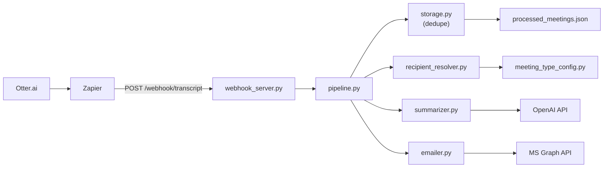

# Meeting Recap Bot -- Implementation Plan

## Architecture

Single-container FastAPI service running locally via Docker. Pipeline:

## Project Structure

All source files live in the repo root (no `src/` directory):

- `config.py` -- env var loading/validation via `python-dotenv`
- `main.py` -- entrypoint, starts FastAPI via uvicorn
- `webhook_server.py` -- FastAPI app with `POST /webhook/transcript` and `GET /health`
- `pipeline.py` -- orchestrates: dedupe -> resolve -> summarize -> email
- `summarizer.py` -- OpenAI Chat Completions with `instructions.md` as system prompt
- `emailer.py` -- MS Graph REST email sender via `httpx` + `azure-identity`
- `recipient_resolver.py` -- 3-tier recipient fallback
- `meeting_type_config.py` -- loads/matches `meeting_types.json`
- `storage.py` -- JSON file-based dedupe with `filelock`
- `tests/` -- pytest suite with unit + integration tests

---

## Phase 1 -- Before Payload Capture

These components are fully implementable without the real Zapier payload shape.

### 1. Project Scaffold

Create the file structure and dependency files:

- `requirements.txt` with pinned deps: `openai==2.26.0`, `azure-identity==1.25.2`, `fastapi==0.135.1`, `uvicorn[standard]==0.41.0`, `python-dotenv==1.2.2`, `Markdown==3.10.2`, `nh3==0.3.3`, `httpx==0.28.1`, `filelock==3.17.0`, `pydantic==2.11.1`
- `requirements-dev.txt`: `pytest==9.0.2`, `pytest-asyncio==0.25.3`, `respx==0.22.0`
- `Dockerfile` (Python 3.12-slim, healthcheck via `/health`)
- `docker-compose.yml` (env_file, port 8000, volume mounts for `processed_meetings.json`, `instructions.md`, `meeting_types.json`, `restart: unless-stopped`)
- `.env.example` with all vars from Section 3 of the plan
- `meeting_types.json` with empty `{}` placeholder
- `fixtures/sample_otter_webhook.json` with the placeholder payload from the plan (will be replaced after real capture)

### 2. `config.py`

- Load `.env` via `python-dotenv`
- Validate all required vars: `OPENAI_API_KEY`, `MS_GRAPH_CLIENT_ID`, `MS_GRAPH_CLIENT_SECRET`, `MS_GRAPH_TENANT_ID`, `EMAIL_FROM`, `WEBHOOK_SECRET`
- Typed defaults: `EMAIL_CC="bill.johnson@scribendi.com"`, `MAX_TRANSCRIPT_CHARS=100000`, `OPENAI_MODEL="gpt-4o"`, `WEBHOOK_HOST="0.0.0.0"`, `WEBHOOK_PORT=8000`, `LOG_LEVEL="INFO"`
- Fail fast with clear error on missing required vars

### 3. `storage.py`

- `is_processed(meeting_id) -> bool` and `mark_processed(meeting_id, title) -> None`
- JSON file format: `{"id": {"processed_at": "...", "title": "..."}}`
- Use `filelock` for concurrent access safety
- Auto-create file if missing; handle corruption (backup + fresh start)

### 4. `meeting_type_config.py`

- Load `meeting_types.json` at startup
- Case-insensitive substring match against meeting titles
- First-match-wins ordering
- Return empty list if file missing, empty, or malformed (log warning)

### 5. `recipient_resolver.py`

Three-tier fallback:

1. Payload participants (filter empty/invalid emails, normalize lowercase)
2. Distro list from `meeting_type_config.py`
3. Bill fallback (`EMAIL_CC` as sole To, no CC)

Bill always CC'd unless he's the sole To recipient. Deduplicate Bill from CC if he's in To.

Output: `ResolvedRecipients(to=list[str], cc=list[str])`

### 6. Phase 1 Unit Tests

- `tests/test_storage.py` -- dedupe logic, file creation, corruption recovery, concurrent access
- `tests/test_meeting_type_config.py` -- matching, ordering, missing file, malformed JSON
- `tests/test_recipient_resolver.py` -- all 3 tiers, edge cases (Bill dedup, invalid emails)
- `tests/conftest.py` -- shared fixtures

---

## STOP POINT -- Human Step Required

After Phase 1, the user must:

1. Deploy bare-minimum webhook that logs raw request body
2. Configure Zapier Zap: Otter.ai trigger -> POST to local endpoint
3. Run a test meeting, capture real payload
4. Save as `fixtures/sample_otter_webhook.json`
5. Only then proceed to Phase 2

---

## Phase 2 -- After Payload Capture

### 7. `webhook_server.py`

- FastAPI app with `POST /webhook/transcript` and `GET /health`
- Auth: validate `X-Webhook-Secret` header or `Authorization: Bearer <secret>`
- Pydantic model based on captured fixture (use `Optional` for uncertain fields)
- Return codes: 200 processed, 200 duplicate, 401 auth fail, 422 malformed
- Log unexpected fields for debugging

### 8. `summarizer.py`

- Load `instructions.md` once, cache at module level
- System message: full `instructions.md` contents
- User message: `"generate meeting summary for this as per the instructions without citations\n\n{transcript}"`
- Model: `config.OPENAI_MODEL`, temperature: 0.3
- Transcript truncation at `MAX_TRANSCRIPT_CHARS` with `\n\n[Transcript truncated due to size limit]` marker
- Retry: 3 attempts, exponential backoff (1s, 4s, 16s)

### 9. `emailer.py`

- `azure-identity.ClientSecretCredential` as lazy singleton (not at import time)
- `httpx` POST to `https://graph.microsoft.com/v1.0/users/{EMAIL_FROM}/sendMail`
- Markdown -> HTML via `markdown` lib, sanitize via `nh3` (allowed tags: `p`, `h1-h6`, `ul`, `ol`, `li`, `strong`, `em`, `a`, `br`, `blockquote`, `code`, `pre`)
- Subject: `[Meeting Recap] <Title> — <MMM DD, YYYY>`
- Retry: 3 attempts, exponential backoff
- Failure notification email to Bill on summarization failure

### 10. `pipeline.py`

Synchronous `process_meeting(payload)`:

1. Check `storage.is_processed` -> return DUPLICATE
2. Resolve recipients
3. Truncate transcript if needed
4. Summarize (fail -> notify Bill, return FAILED)
5. Send email (fail -> return FAILED, do NOT mark processed)
6. Mark processed
7. Return SUCCESS

Key invariant: only mark processed after email succeeds.

### 11. `main.py`

- Validate config, load `instructions.md`, load `meeting_types.json` eagerly
- Configure logging: `%(asctime)s %(levelname)s [%(name)s] %(message)s`
- `uvicorn.run(app, host=WEBHOOK_HOST, port=WEBHOOK_PORT)`

### 12. Phase 2 Tests

- `tests/test_webhook_server.py` -- auth, payload parsing, duplicate handling
- `tests/test_summarizer.py` -- message construction, truncation, model config
- `tests/test_emailer.py` -- email payload, HTML sanitization, Graph REST call, failure notification
- `tests/test_pipeline_integration.py` -- full happy path, duplicate, missing participants, auth failure, OpenAI failure, Graph failure, oversized transcript
- Mock strategy: `unittest.mock.patch` for OpenAI client, `respx` for Graph REST, `httpx.AsyncClient` with `ASGITransport` for FastAPI

### 13. `README.md`

Full setup guide: env vars, Azure AD prerequisites, Docker workflow, ngrok/Cloudflare Tunnel setup, Zapier configuration, manual test workflow with curl commands.

---

## Key Design Decisions

- **Sync pipeline**: `pipeline.process_meeting()` is synchronous; FastAPI runs it in a thread pool automatically
- **No `msgraph-sdk`**: Direct REST via `httpx` + `azure-identity` for token acquisition
- **200 for duplicates**: Zapier treats non-2xx as failures and retries; returning 200 prevents infinite retry loops
- **Fail open on storage errors**: Process the meeting rather than dropping it if dedupe file is unreadable
- All log lines after payload parsing include `[meeting_id]` for correlation

